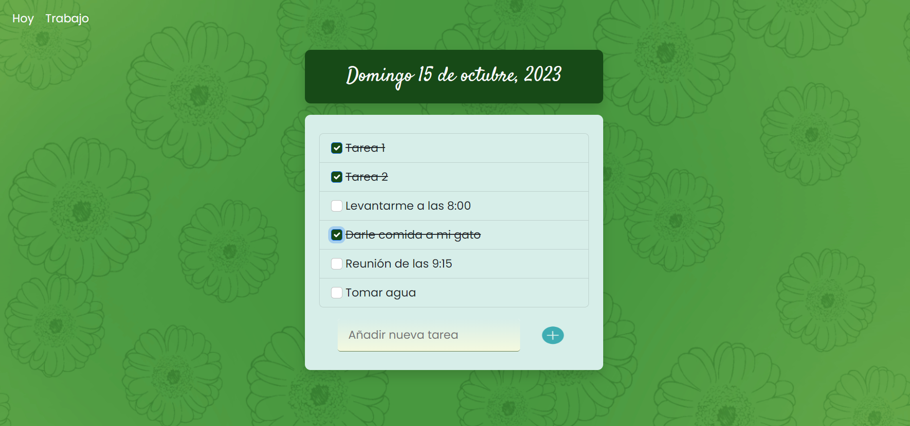

# Aplicación JS To Do List / To Do List JS Application

## Descripción / Description

[es] Esta aplicación permite crear una lista de tareas para el día a día, tanto para la vida personal, como para el trabajo. Una vez terminadas las actividades, es posible tacharlas de la lista.

[en] This application allows you to create a list of tasks for your daily life, both for your personal life and for work. Once the activities are finished, it is possible to cross them off the list.



## Instalación / Installation

[es] Ingresar el siguiente comando en la terminal:

[en] Enter the following command in the terminal:

```bash
    npm i
```
[es] Para ejecutar la aplicación ingresar este comando:

[en] To run the application enter this command:

```bash
    node index.js
```

[es] Para finalizar, ingresa a http://localhost:3000

[en] To finish, enter http://localhost:3000